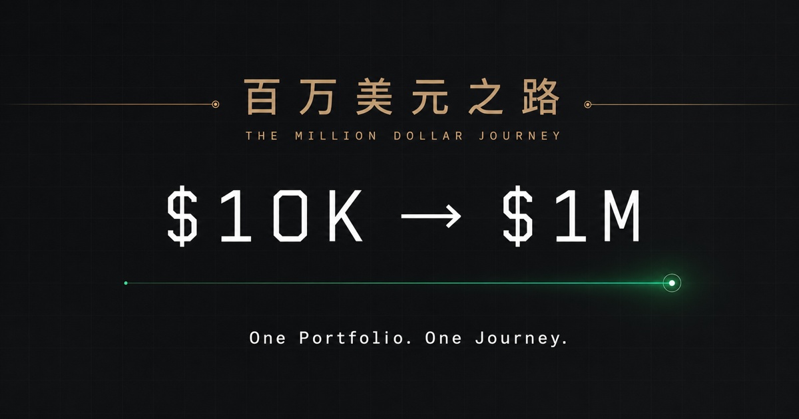

# The Million Dollar Journey · 百万美元之路

**$10,000 → $1,000,000 · One Portfolio. One Journey.**

丁小山美股公开投资：基于 IBKR 的中英双语个人投资看板与成长记录。
A bilingual investment dashboard and journal following Ding Xiaoshan's IBKR portfolio.



## 项目 / Project

- 中文人民币展示、英文美元展示；Twelve Data 提供 USD/CNY 汇率。
- 账户净值、收益、历史曲线、资产配置和股票/期权持仓。
- 百万美元目标进度、里程碑和铜牛奔跑动画；支持减少动态效果设置。
- 根据访问者本地时间切换昼夜主题，另有 `/jade-key` Three.js 展示页。
- IBKR Flex 只读报表接入，配置每日北京时间 07:30 检查及访问时补同步。

Website: [百万美元之路 · OpenInvestAI](https://openinvestai.com/). English: [openinvestai.com/en](https://openinvestai.com/en).

The production site now runs on Cloudflare Workers with a dedicated D1 database. `www.openinvestai.com` redirects to the root domain. See [Cloudflare deployment](docs/CLOUDFLARE.md) for build commands, runtime secrets and current synchronization limitations. The original Sites deployment is retained separately.

The source originates from Sites **version 33**. GitHub **v1.0.0** is the initial archive; subsequent commits add direct Cloudflare deployment. The earlier comprehensive optimization plan is not included.

## 本地运行 / Run locally

Requires Node.js 22.13+ and npm. Use Node.js 22 LTS for the locked dependencies.

```sh
git clone https://github.com/AlibabaOpenSesame/TheMillionDollarJourney.git
cd TheMillionDollarJourney
npm ci
npm run dev
```

Open the local URL printed by the development server. Routes: `/` (Chinese), `/en` (English), `/jade-key` (3D key). Without a configured database and secrets, the original app displays its bundled historical fallback; it is not live data. The exported data below is not automatically loaded into the UI.

```sh
npm run data:validate
npm run build
npm run test:unit
```

The original `npm test` is preserved for traceability, but contains obsolete starter-page assertions. See [known issues](docs/KNOWN_ISSUES.md); a passing unit job does not mean that legacy suite is fixed.

## 数据 / Data

[`data/export/`](data/export/) contains all available production database rows at export time. Schema and counts are in [`manifest.json`](data/export/manifest.json).

| Table | Rows | Meaning |
| --- | ---: | --- |
| portfolio_snapshots | 195 | Stored net asset and account metric snapshots |
| portfolio_positions | 16 | Stored positions across available dates |
| fx_rates | 1 | Latest cached exchange rate |
| sync_runs | 10 | Recorded synchronization results |

Latest stored portfolio date: **2026-09-14**. Export date: **2026-09-16**. Export time does not imply fresher market data. This export includes investment amounts, positions and performance as authorized by the owner. Credentials and brokerage account identifiers are excluded. Existing public-facing contacts and branding are retained.

This is a **snapshot**, not an automatically updating GitHub mirror, complete broker statement or transaction ledger. Historical NAV imports may lack other account fields; do not interpret every historical zero as a measured value. Only position dates actually stored are available.

Generate a portable SQLite/D1 seed after applying migrations in `drizzle/`:

```sh
npm run --silent data:sql > portfolio-seed.sql
```

The seed upserts the four exported tables in one transaction. Review the target database first: matching records are replaced with exported values. New installations must configure their own D1 binding and apply migrations in filename order. Export and restore do not grant IBKR access.

## 配置 / Configuration

Configure runtime secrets in the hosting provider, never in committed files:

| Variable | Purpose |
| --- | --- |
| IBKR_FLEX_TOKEN | Read-only Flex Web Service token |
| IBKR_FLEX_QUERY_ID | Flex report query identifier |
| IBKR_SYNC_SECRET | Authorization for manual synchronization |
| IBKR_MANUAL_IMPORT_SECRET | Optional separate authorization for portfolio imports |
| TWELVE_DATA_API_KEY | USD/CNY quote provider |

`.env.example` lists names only. For local Workers secrets, use ignored `.dev.vars` with the same names. The D1 binding is `DB`; `.openai/hosting.json` identifies the existing Sites project. A fork must register its own hosting project and database before deployment. GitHub Pages alone cannot run the Worker/D1 backend.

Cron `30 23 * * *` (UTC) corresponds to 07:30 Asia/Shanghai. This is a configured check time, not a guarantee that IBKR has published a new report. The last recorded export run is a recovery run. See [known issues](docs/KNOWN_ISSUES.md).

## Architecture

React 19 + TypeScript + vinext/Vite; Cloudflare Worker + D1 + Drizzle; Three.js for the key page. `app/` contains pages/UI, `worker/` IBKR/FX integration, `db/` and `drizzle/` schema/migrations, `public/` assets, and `tests/` inherited checks.

## 版本管理 / Versioning

`main` is the public baseline. Use `codex/<topic>` branches and pull requests; record user-visible changes in [CHANGELOG.md](CHANGELOG.md). Releases use `vMAJOR.MINOR.PATCH`; never move published tags. Code and data changes should be separate commits. Every export must update its manifest and pass validation. See [CONTRIBUTING.md](CONTRIBUTING.md).

Public history begins with the reviewed v33 snapshot, without private repository history. The original source commit is in [PROVENANCE.md](docs/PROVENANCE.md). No open-source redistribution license is granted by this initial publication; third-party assets and dependencies retain their respective rights. Portfolio records describe the owner's account, not investment advice.
